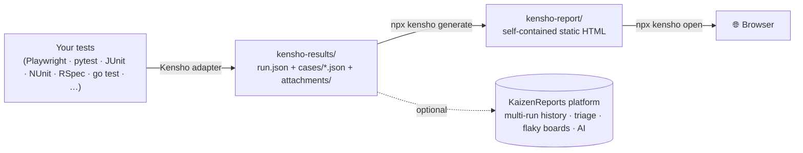

<div align="center">

# Kensho — 検証

**Beautiful, framework-agnostic test reports. Open source. Zero config. No server.**

[](./LICENSE)
[](https://github.com/brandon1794/kensho/actions/workflows/ci.yml)
[](https://www.npmjs.com/package/@kaizenreport/kensho)
[](https://pypi.org/project/kensho-pytest/)
[](https://nodejs.org)

</div>

> **検証 (kenshō)** — "verification." Kensho turns the results of *any* test framework into a single, self-contained, beautiful HTML report — the way [Allure](https://github.com/allure-framework/allure2) does, but with one canonical format across every language, a zero-dependency viewer, and nothing to run on a server.

---

## Why Kensho?

Test runners each ship their own half-baked HTML output, and none of them agree. If your stack is polyglot (Playwright + pytest + JUnit + …), you get a different report per tool and no shared story. The hosted alternatives lock that story behind an account.

Kensho fixes that with **one open format** and **one viewer**:

- 🎯 **One format, every language.** 24 adapters all emit the canonical [Kensho v1](./packages/schema/schema.json) JSON. Same report whether your tests are TypeScript, Python, Java, C#, Ruby, or Go.
- ⚡ **Fast + self-contained.** The viewer is a static SPA — boots in well under a second on 10k+ tests. The report is just a folder: open it locally, drop it on S3, attach it to CI. No server, no database, no API key.
- 🪜 **Real test structure.** Nested step trees (setup / body / teardown), per-step logs, attachments (screenshots, videos, traces), parameters, links, and labels.
- 🔁 **Retries, flaky signal, history & behaviors** as first-class tabs — derived from a single run (no multi-run backend required).
- 🎨 **Customizable.** Drop a `kensho.config.json` to rebrand, set an accent color, hide tabs, or register failure categories.
- 🆓 **Apache-2.0.** Use it, fork it, ship it. Nothing phones home.

## How it works



The adapter is the only piece that touches your test run; everything after the `kensho-results/` folder is identical for every framework.

## Quick start

```bash
# 1. add the adapter for your framework + the CLI (example: Playwright)
pnpm add -D @kaizenreport/kensho-playwright @kaizenreport/kensho

# 2. run your tests (the adapter writes kensho-results/)
npx playwright test

# 3. generate + open the report
npx kensho generate
npx kensho open
```

```ts
// playwright.config.ts
export default {
  reporter: [
    ['line'],
    ['@kaizenreport/kensho-playwright', { output: 'kensho-results', project: { name: 'My App', slug: 'my-app' } }],
  ],
};
```

Other ecosystems:

```bash
pip install kensho-pytest                       # Python / pytest
gem install kensho-rspec                        # Ruby / RSpec
dotnet add package KaizenReport.Kensho.NUnit    # .NET / NUnit
# Java (Maven):  com.kaizenreports:kensho-junit5:0.1.1
```

Want to see it first? Run the bundled demo (no browsers needed):

```bash
pnpm install && cd examples/playwright-demo && pnpm run demo   # seed → generate → open
```

## CLI

```
npx kensho <command>
```

| Command | What it does |
|---|---|
| `generate` | `kensho-results/` → a self-contained `kensho-report/` static site |
| `open` | Serve the report locally (traversal-protected) + open the browser |
| `validate` | Check a results dir against the Kensho v1 schema |
| `diff <prev> <cur>` | Terminal punch-list of new failures/fixes + optional static diff site |
| `badge` | Emit an SVG status badge from a run |
| `version` | Print the CLI + schema version |

`generate` also resolves test-file owners from `.github/CODEOWNERS` (`--codeowners` / `--no-codeowners`).

## Adapters

Every adapter writes the same `kensho-results/` shape, so the report and CLI behave identically.

### JavaScript / TypeScript — npm (`@kaizenreport/*`)
| Framework | Package |
|---|---|
| Playwright | `@kaizenreport/kensho-playwright` |
| Cypress | `@kaizenreport/kensho-cypress` |
| Jest | `@kaizenreport/kensho-jest` |
| Vitest | `@kaizenreport/kensho-vitest` |
| Cucumber.js | `@kaizenreport/kensho-cucumber-js` |
| Jasmine | `@kaizenreport/kensho-jasmine` |
| Postman / Newman | `newman-reporter-kensho` |
| k6 (load) | `@kaizenreport/kensho-k6` |
| Appium (WDIO) | `@kaizenreport/kensho-appium` |
| Detox (React Native) | `@kaizenreport/kensho-detox` |
| Go (`go test -json`) | `@kaizenreport/kensho-go` |
| XCUITest (xcresult) | `@kaizenreport/kensho-xcuitest` |
| Any JUnit XML | `@kaizenreport/kensho-junit-xml` |

### Python — PyPI
`kensho-pytest` (pytest) · `kensho-robot` (Robot Framework)

### Java / JVM — Maven Central (`com.kaizenreports`)
`kensho-junit5` · `kensho-testng` · `kensho-cucumber-jvm`

### .NET — NuGet (`KaizenReport.Kensho.*`)
`Core` · `NUnit` · `MSTest` · `Xunit`

### Ruby — RubyGems
`kensho-rspec` · `kensho-cucumber-ruby`

**Core packages:** [`@kaizenreport/kensho`](./packages/cli) (CLI) · [`@kaizenreport/kensho-schema`](./packages/schema) (format) · [`@kaizenreport/kensho-viewer`](./packages/viewer) (viewer).

## The Kensho v1 format

A results directory is just JSON + files — easy to produce from any language:

```
kensho-results/
├── run.json              # run metadata + totals + env (repo, branch, commit, CI)
├── cases/
│   └── tc_<id>.json      # one file per test: status, steps[], logs, links, labels, attachments
└── attachments/
    └── tc_<id>/...        # screenshots, videos, traces, etc.
```

```jsonc
// cases/tc_775218feb1c579ac.json (trimmed)
{
  "id": "tc_775218feb1c579ac",
  "name": "logs in with valid credentials",
  "status": "pass",                       // pass | fail | skip | broken
  "durationMs": 412,
  "labels": { "feature": "auth", "severity": "critical" },
  "steps": [{ "title": "fill login form", "status": "pass", "steps": [] }],
  "attachments": [{ "name": "screenshot", "path": "...", "contentType": "image/png" }]
}
```

- **Stable case IDs** — `stableCaseId(fullName, filePath)` (double FNV-1a) correlates the same test across runs.
- Every step can carry its own `attachments`, `logs`, `parameters`, and nested `steps`.
- `behavior.epic / feature / scenario` for BDD; `parameters` for data-driven tests.
- All dates are ISO strings; all durations are integer milliseconds.

Validate any dir with `npx kensho validate <dir>`. Full schema + TypeScript types: [`@kaizenreport/kensho-schema`](./packages/schema).

## Customize

Drop a `kensho.config.json` in your repo root:

```json
{
  "brand": { "name": "Acme Test Report", "accent": "#2563EB" },
  "project": { "name": "Acme Web", "slug": "acme" },
  "tabs": { "overview": true, "suites": true, "categories": true, "behaviors": false },
  "redact": ["^SECRET_", "TOKEN$"]
}
```

## Viewer features

Hash-routed deep links (`#/case/<id>`) · keyboard shortcuts (`?` overlay, `/` search, `j`/`k` nav, `g` chords) · Suites / Behaviors / Packages trees with a resizable splitter · Timeline · Flaky · History · Categories · real attachment rendering (image lightbox, `<video>`, typed downloads) · light/dark theme · one-click export. CSS is namespaced `kv-*` so it never collides with a host page.

## Kensho vs. the KaizenReports platform

Kensho is the **free, single-run, static** half. Anything that needs *many* runs — history dashboards, regression alerts, flake rate over time, AI clustering, triage, RBAC — lives in the **[KaizenReports](https://kaizenreports.com)** platform, which ingests `kensho-results/`. The only "comparison" Kensho ships is the local-only `kensho diff`.

## Contributing

Issues and PRs welcome! See [CONTRIBUTING.md](./CONTRIBUTING.md) and our [Code of Conduct](./CODE_OF_CONDUCT.md). This is a pnpm workspace (Node ≥ 22): `pnpm install`, then `cd examples/playwright-demo && pnpm run demo`.

## License

[Apache-2.0](./LICENSE) © KaizenReports.
